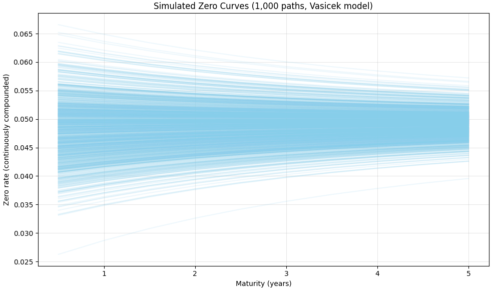

# Vasicek Interest Rate Simulation and Bond Return Analysis

This project implements a **Monte Carlo simulation framework** for modeling short-term interest rate dynamics using the **Vasicek mean-reverting model**, and applies the simulated rate paths to analyze the **distribution of bond returns** over a fixed investment horizon.

The focus of the project is on **interest rate risk, term structure behavior, and return dispersion**, rather than point forecasts.

---

## Project Overview

Interest rates are a primary source of risk for fixed-income securities.  
This project explores how uncertainty in future short rates translates into variability in bond returns by:

- Simulating short-rate paths under the Vasicek model
- Generating corresponding term structures
- Pricing coupon bonds along each simulated path
- Analyzing the distribution of total bond returns

The framework mirrors standard **fixed-income risk modeling** used in asset management and risk management.

---

## Vasicek Model Framework

The short rate follows a mean-reverting stochastic process:

\[
dr_t = a(b - r_t)dt + \sigma dW_t
\]

Where:
- \(a\) controls the speed of mean reversion
- \(b\) is the long-run average interest rate
- \(\sigma\) determines rate volatility
- \(W_t\) is a standard Brownian motion

This structure ensures:
- Rates revert toward a long-run equilibrium
- Volatility remains constant
- Closed-form solutions for zero-coupon bond prices

---

## Simulation Design

- Monthly time steps
- 1,000 Monte Carlo simulation paths
- Continuous compounding
- Model parameters calibrated from given inputs
- Zero-coupon yield curves derived analytically from Vasicek formulas

The simulated short rates are then extended across maturities to construct full yield curves at each time step.

---

## Simulated Interest Rate Paths

The figure below shows simulated Vasicek short-rate trajectories across the investment horizon.

Key observations:
- Strong mean reversion toward the long-run rate
- Dispersion increases over time
- No explosive behavior due to model stability

---

## Bond Pricing and Reinvestment Logic

- Coupon bonds are priced using simulated zero rates
- Coupon payments are reinvested continuously at simulated short rates
- For bonds not yet matured, remaining cash flows are discounted at the horizon using simulated term structures
- Total return is computed as final wealth relative to initial price

This approach captures both:
- Price risk
- Reinvestment risk

---

## Distribution of Bond Returns

The Monte Carlo simulation produces a full distribution of total bond returns over the investment horizon.

Insights from the distribution:
- Mean and median returns are closely aligned
- Dispersion reflects maturity and coupon structure
- Downside risk is visible through lower-tail outcomes
- Longer-maturity bonds exhibit wider return dispersion

---

## Key Insights

- Mean reversion stabilizes long-term interest rate behavior
- Reinvestment assumptions materially affect total returns
- Return distributions provide richer risk information than point estimates
- Vasicek is well-suited for analytical term structure simulations but does not capture jumps or volatility clustering

---

## Limitations

- Vasicek allows negative interest rates
- Volatility is assumed constant
- No regime shifts or macroeconomic shocks are modeled

Despite these limitations, the model remains a foundational tool for fixed-income risk analysis.

---

## Disclaimer

This project is for **educational and research purposes only**.

- Simulation results depend on model assumptions
- Outputs should not be interpreted as investment advice
- The analysis is illustrative rather than predictive

